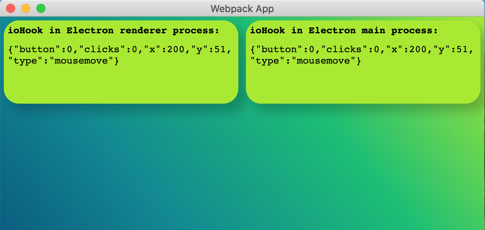

# ioHook + Electron + Webpack integration

#### Installation steps:

npm install

###### to start electron in development mode:

npm run start

###### to build electron production binary:

npm run dist

#### Additional info

* You can read about implementation specific in an article: [ioHook + Electron + Webpack integration](https://ievgeniispitsyn.medium.com/iohook-electron-webpack-integration-53c9fe010bca)

* ioHook MacOS, Windows and Linux binaries for Electron 10 and ioHook 0.9.0 uploaded during npm install. If you want to use other ioHook or electron or node versions combination you can do it either manually (check ioHook documentation: [ioHook](https://wilix-team.github.io/iohook/manual-build.html#building-for-specific-versions-of-node) ) or check available binaries in project repo: [ioHook releases](https://github.com/wilix-team/iohook/releases). 
